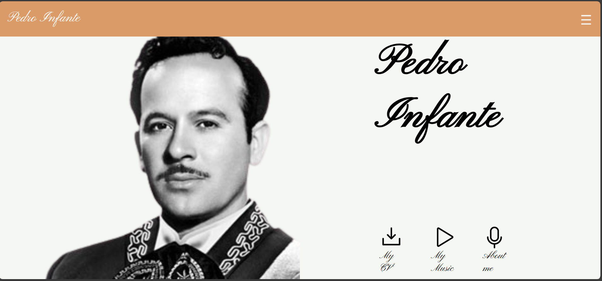
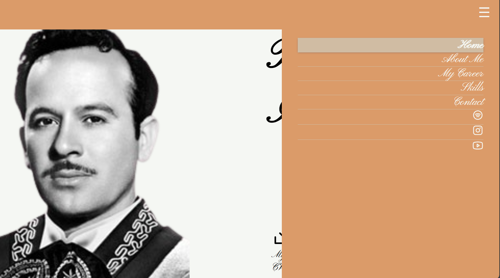

# Pedro Infante – Frontend Portfolio (Vanilla JS)

## 📌 Overview

This project is a **pedagogical and fast frontend portfolio sample** built using a pure frontend stack: **HTML, CSS, and Vanilla JavaScript**.  
It focuses on **clean architecture, responsive design, microinteractions, and UX-driven behavior**, avoiding frameworks to explore the fundamentals behind modern frontend technologies.

The project is designed to be both **production-like** and **educational**, serving as a reusable base for future projects and as a learning resource for junior developers and students.

---

## 🎯 Objectives

- Build a modern, responsive portfolio using only **core frontend technologies**
- Practice **DOM manipulation, event handling, and state management** without abstractions
- Implement **microinteractions and animations** to enhance UX
- Create a **realistic portfolio structure** suitable for job applications
- Serve as a **pedagogical reference** for frontend students

---

## 👥 Target Audience

- **Recruiters** reviewing frontend fundamentals
- **Junior Frontend Developers** strengthening core skills
- **12th grade students** using this project as a learning base
- **Myself**, as a reusable component library and technical reference

---

## 🛠️ Tech Stack

- **HTML5**
- **CSS3** (advanced selectors, transitions, animations, responsive design)
- **Vanilla JavaScript (ES6+)**

### Why no frameworks?

This project intentionally avoids frameworks like React or Vue in order to:
- Understand the **roots of modern frontend frameworks**
- Reduce abstraction and focus on **core concepts**
- Keep the codebase **simple, readable, and pedagogical**
- Provide a solid base for students before introducing complex tooling

> Simple is better — especially when learning.

---

## 🧠 Core Concepts Practiced

- DOM manipulation
- Event bubbling and event delegation
- UI state handling without frameworks
- Responsive navigation logic
- UX-driven interactions
- Transitions and animations
- Portfolio-oriented layout and structure
- UX/UI implementation from a previous mockup
- Advanced CSS with multiple selectors

---

## 🧩 JavaScript Architecture

The JavaScript is organized in **separated files**, each responsible for a specific functionality, such as:

- Component injection
- Header and navigation logic
- Form validation
- Material-style interactions
- Lightbox effects
- Dynamic sliders
- Page transitions
- Parallax effects

This modular structure allows:
- Easy maintenance and scalability
- Clear separation of concerns
- Reusability of components in future projects

Although no framework is used, the structure follows **component-based principles inspired by React**, implemented manually to better understand how these patterns work under the hood.

---

## 🍔 Header & Navigation Logic

The header behavior is handled by a dedicated `initHeader` function, fully encapsulated and independent from other DOM sections.

Key concepts applied:
- `addEventListener` for controlled interactions
- `stopPropagation()` to manage event bubbling
- `closest()` to detect clicks outside the menu
- `classList.toggle()` for simplified state transitions
- Active link detection based on the current URL

This approach ensures:
- Clean UX behavior
- Predictable menu state
- No unwanted DOM side effects

---

## ✨ UX & Microinteractions

- Fully responsive design with multiple media queries
- Smooth page transitions using `requestAnimationFrame()`
- Persistent header across dynamic page transitions
- Button and container micro-animations for immediate feedback
- Discography section animations inspired by music records for thematic coherence

Each interaction is designed to **reduce friction**, **guide the user**, and **improve navigation clarity**.

---

## 📸 Preview

### Desktop

### Mobile

### Menu Interaction

---

## 🚀 Live Demo

The project is deployed using **GitHub Pages**:

👉 **Live Demo:**  
https://alysoncastiblanco.github.io/PedroInfantePortfolio/

No installation is required.

---

## 📂 How to Explore the Project

- **Students:**  
  Start with the HTML and CSS files, then move to the JavaScript files.  
  **Read all comments** — every element exists for a reason.

- **Recruiters / Developers:**  
  Focus on:
  - Header navigation logic
  - JavaScript structure
  - Event handling patterns
  - UX-driven decisions

---

## 📖 Final Notes

This project is not meant to replace modern frameworks, but to **strengthen the foundations** required to use them properly.  
Understanding how things work without abstractions makes you a better frontend developer.
